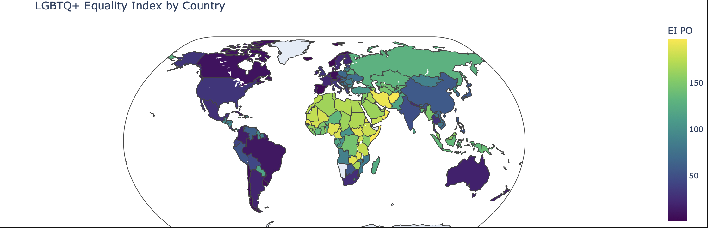

# Equality Mapping Project
## By Juan Zumarán

I created this website with a python notebook, using data from Equaldex, a public API with data for at least 197 countries on LGBT data. 

The goal of this project is to analyze the data from a world perspective, a continent perspective, and an in-depth analysis into the “best” countries to be LGBTQ+ in or travel to, and the “worst” ones. Does the Equality Index vary from country to country visually? How do different continents compare? What can we say about the lowest ranking countries? 
The goal of this project is to build using python notebooks and specifically, the plotly library to create a series of choropleth maps that use the data from the csv obtained from Equaldex’s API. 

# Public Opinion Index
The lower the value, the lower users of the website rank that country. The higgher the value, means this country has a lot of upvotes and this is probably because the users feed the website of Equaldex with valuable information. 

The World:

How is the index distributed across the continents? can we say something about the overall distributions?

Europe Map:

South America Map:

North America Map:

Asia Map:

Africa Map:

Oceania Map:

