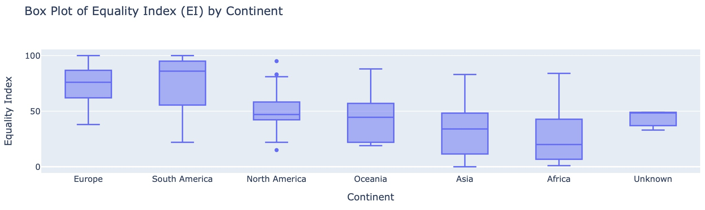
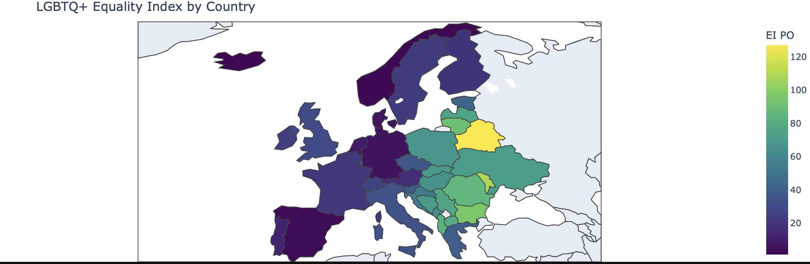
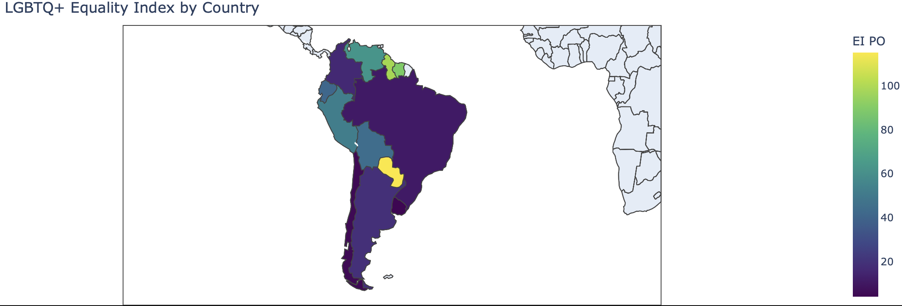
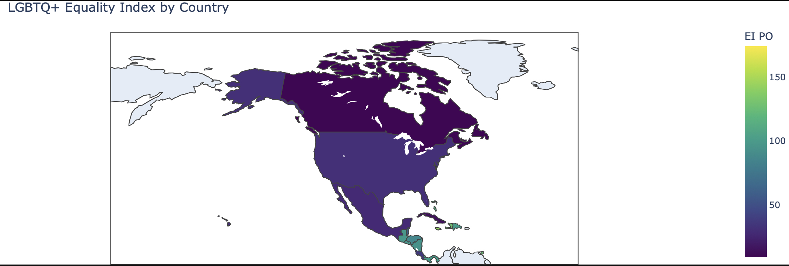
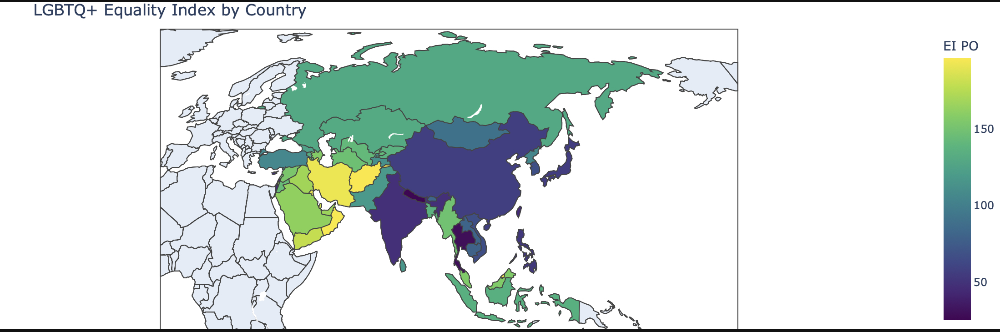
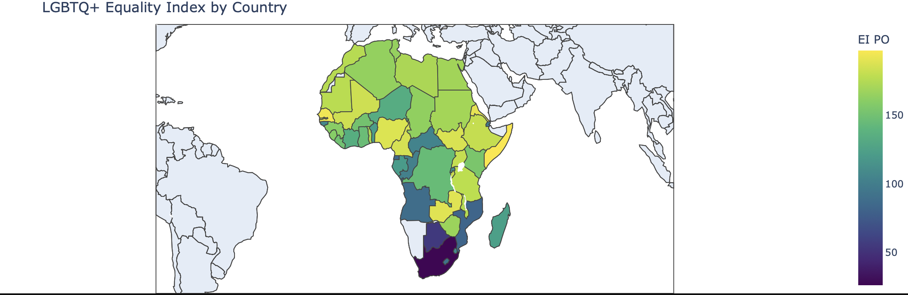
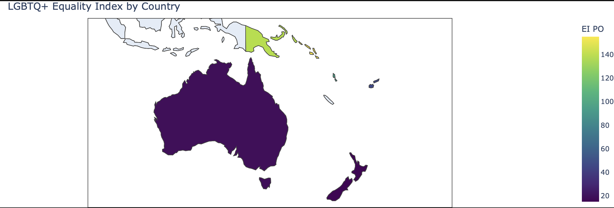

# Equality Mapping Project
## By Juan Zumarán

I created this website with a python notebook, using data from Equaldex, a public API with data for at least 197 countries on LGBT data. 

The goal of this project is to analyze the data from a world perspective, a continent perspective, and an in-depth analysis into the “best” countries to be LGBTQ+ in or travel to, and the “worst” ones. Does the Equality Index vary from country to country visually? How do different continents compare? What can we say about the lowest ranking countries? 
The goal of this project is to build using python notebooks and specifically, the plotly library to create a series of choropleth maps that use the data from the csv obtained from Equaldex’s API. 

# Public Opinion Index
The lower the value, the lower users of the website rank that country. The higher the value, means this country has a lot of upvotes and this is probably because the users feed the website of Equaldex with valuable information. 

How is the index distributed across the continents? can we say something about the overall distributions?

Europe has the highest values, while Africa and Asia have a bigger range of values, but overall they both have a lower average than other regions. South America has a lot of high value, and the averge is higher than Europe's, but there are some low scores from some countries.

Europe Map:

Highlights: Iceland, Norway, Germany, Spain and the Netherlands.

Lowlights: Belarus, Moldova, Bulgaria

This makes sense because a lot of countries in Europe have undergone secularization, separating the church from the state. Aslo becuase many of the first human rights conventions and the EU or the UN have a bigger impact in Europe. Many believe this continent has a higher acceptance rate and less criminalization of LGBTQ+ becuase of the protests and civil rights movements.

South America Map:

Highlights: Uruguay, Chile, Brazil, Argentina and Colombia

Lowlights: Paraguay, Guyana and Suriname

South America's progress on LGBTQ+ rights can be traced to a mix of legal reforms, activism, and cultural change. Many countries in the region have passed progressive laws in recent years, like legalizing same-sex marriage and allowing gender changes without surgery. Also, strong LGBTQ+ activism and human rights movements—especially after military dictatorships—have pushed for more inclusion. International influence from the UN and the Inter-American Court of Human Rights has also played a role. Many believe this region has growing acceptance because of youth movements, left-leaning politics, and public protests demanding equality and visibility for LGBTQ+ people.

North America Map:

Highlights: Canada, Mexico, USA and Costa Rica

Lowlights: Haiti, Dominican Republic Panama and Jamaica

North America shows a mixed picture when it comes to LGBTQ+ rights. In countries like Canada and parts of the United States, LGBTQ+ individuals enjoy broad protections, marriage equality, and public acceptance. Canada, in particular, has strong human rights laws and a long-standing commitment to inclusion. In the U.S., civil rights movements and legal battles—like the Supreme Court ruling on same-sex marriage in 2015—have pushed progress, though acceptance still varies by state and region.

In Central America, the situation is more complicated. While there are signs of progress in countries like Costa Rica, which legalized same-sex marriage in 2020, others still have strong religious influence, legal barriers, and social stigma. LGBTQ+ people in some Central American countries face discrimination, violence, and limited legal protection. However, activism is growing, especially among younger generations and through social media, bringing more visibility and pushing for change across the region.

Asia Map:

Highlights: Thailand, Nepal, Japan, India

Lowlights: Russia, Afghanistan, Iran, Oman, Qatar and Brunei

Asia is incredibly diverse, and LGBTQ+ rights vary widely across the continent. Places like Thailand, Nepal, and India have made important steps. India decriminalized same-sex relationships in 2018, and Nepal recognizes a third gender on official documents. These changes often come from strong activist movements, court rulings, and public pressure for human rights.

However, in many other parts of Asia, LGBTQ+ people still face strict laws, social stigma, and cultural taboos, especially where conservative religious or traditional values dominate. In countries like Afghanistan, Iran, or Saudi Arabia, same-sex relationships can still lead to arrest or worse. While acceptance is growing in cities and among younger generations, LGBTQ+ communities across much of Asia continue to fight for basic rights and visibility, often at great personal risk.

Africa Map:

Highlights: South Africa and Botswana, 

Lowlights: Somalia, Senegal and Zambia

Africa has a wide range of experiences when it comes to LGBTQ+ rights, but overall, the region faces many challenges. In a few countries like South Africa, there are strong legal protections—same-sex marriage has been legal since 2006, and the constitution explicitly bans discrimination based on sexual orientation. Activists there have made major progress, and LGBTQ+ communities are visible in some urban areas.

But in many other African countries, LGBTQ+ individuals continue to face harsh conditions. In Somalia, for example, same-sex relations are criminalized under both civil and Islamic law, and people can face severe punishment, including imprisonment or even death in some areas. In Senegal, same-sex acts are also criminalized, and LGBTQ+ people face arrests, social exclusion, and violence. Public attitudes in both countries are largely hostile, often influenced by religious and cultural beliefs.

Brief History of Anti LGBTQ+ Laws in Africa: https://debunk.media/a-brief-history-of-anti-lgbtq-legislation-in-africa/
Did Europe bring homophobia to Africa?: https://www.aaihs.org/did-europe-bring-homophobia-to-africa/
Senegal Info: https://www.africanews.com/2022/07/29/rise-of-homophobia-in-senegal-forcing-lgbtq-people-into-the-shadows//
Somalia Info: https://cornerstone.lib.mnsu.edu/cgi/viewcontent.cgi?article=2316&context=etds

Oceania Map:

Highlights: Australia, New Zealand and Fiji

Lowlights: Papua New Guinea and Solomon Islands

Oceania includes both highly progressive countries and places where LGBTQ+ rights are still limited. In countries like Australia and New Zealand, there have been major strides toward equality—same-sex marriage is legal, anti-discrimination laws are strong, and LGBTQ+ people are increasingly visible in politics, media, and public life. These changes are the result of years of activism, legal reform, and growing public support, especially in urban areas.

In contrast, many Pacific Island nations still face challenges. In Fiji, same-sex relationships are legal and the constitution bans discrimination based on sexual orientation, making it one of the more progressive Pacific countries on paper. 

Still, across Oceania, from Fiji to Samoa and Papua New Guinea, there are grassroots LGBTQ+ movements working to create change.

# Here is an Interactive Map! zoom in, out, pan around or click countries to learn more...

